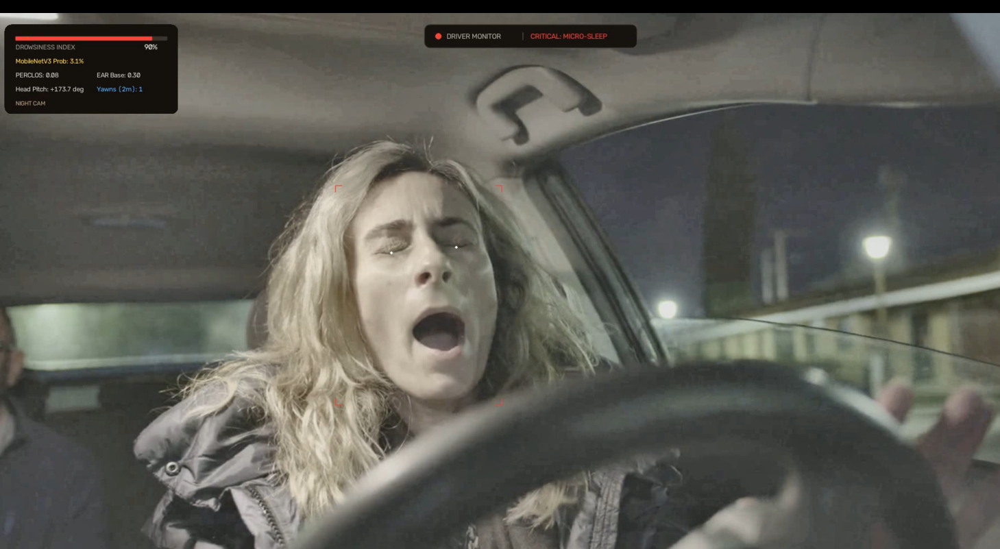

# AI-Based Driver Drowsiness Detection System

An AI-powered driver drowsiness detection system built with Python, OpenCV, MediaPipe, and TensorFlow Lite  to monitor driver alertness in real time by analyzing eye closure, facial landmarks, head pose, yawning, and microsleep events. The system features adaptive calibration, low-light image enhancement, a real-time dashboard, audio alerts, and automatic risk scoring, with support for both webcam input and video files. It also saves annotated output videos and detailed CSV logs for further analysis.
if u need model u can email me 

<h2>📸 Project Screenshot</h2>

